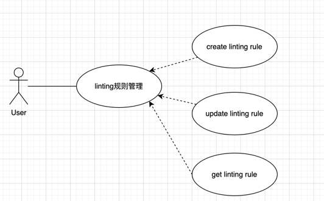
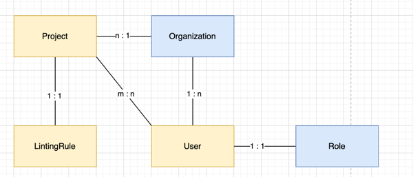

# kong-homework
Kong inc take home task

# 用例图

# 领域模型
> 针对PDF中的需求描述，划分为三个上下文，其中身份验证上下文和项目管理上下文是假设已经存在的上下文。
## 身份验证上下文
### 领域对象
#### 实体
User（用户）
#### 领域服务：
- AuthenticationService（身份验证服务）：负责处理用户身份验证、令牌生成和验证，以及用户权限的管理。
- ProjectAccessService（项目访问服务）：负责检索特定用户具有访问权限的项目 ID 列表。

## 项目管理上下文
### 领域对象
#### 实体
Project（项目），User（用户）
#### 领域服务：
- ProjectManagementService（项目管理服务）：负责处理项目的创建、编辑和删除。
- UserProjectService（用户项目服务）：负责处理用户与项目之间的关联操作。

## Linting规则管理上下文
### 领域对象
#### 实体
LintingRule（Linting规则）

#### 领域服务：
- LintingRuleService（Linting规则服务）：负责创建、更新和查询Linting规则。

### 实体/值对象关系
> 注：黄色为实体，蓝色为值对象

